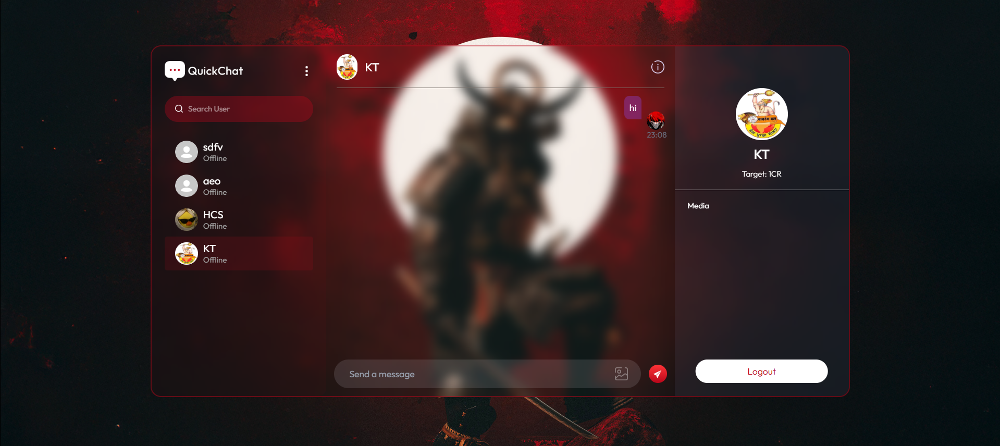
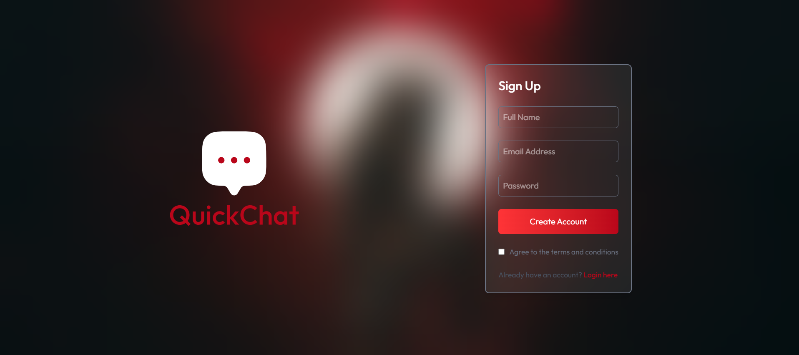

# 💬 QuickChat Application

A real-time chat application built using the **MERN Stack** and **Socket.IO**, enabling seamless bidirectional WebSocket communication.  
This project was completed first and then uploaded to the repository.

---

## 🚀 Overview

**QuickChat** is a modern messaging platform that allows users to exchange messages instantly. It uses **Socket.IO** to manage live communication between the server and connected clients, ensuring that messages update in real time without refreshing the page.

---

## ✨ Features

- 🔥 Real-time messaging using WebSockets
- 🔁 Bidirectional event-based communication (Socket.IO)
- 👤 User join/leave notifications
- 💻 Responsive React UI
- 🛠 Node.js + Express backend
- 🌐 Easy local setup & deployment ready

---

## 🧰 Tech Stack

| Layer | Technology |
|--------|------------|
| Frontend | Tailwind, React, JavaScript |
| Backend | Node.js, Express.js |
| Realtime | Socket.IO |
| Database | MongoDB, Mongoose |
| Authentication | bcrypt, jsonwebtoken |
| Others | dotenv, CORS, axios, cloudinary |

---

## 📸 Screenshot

---